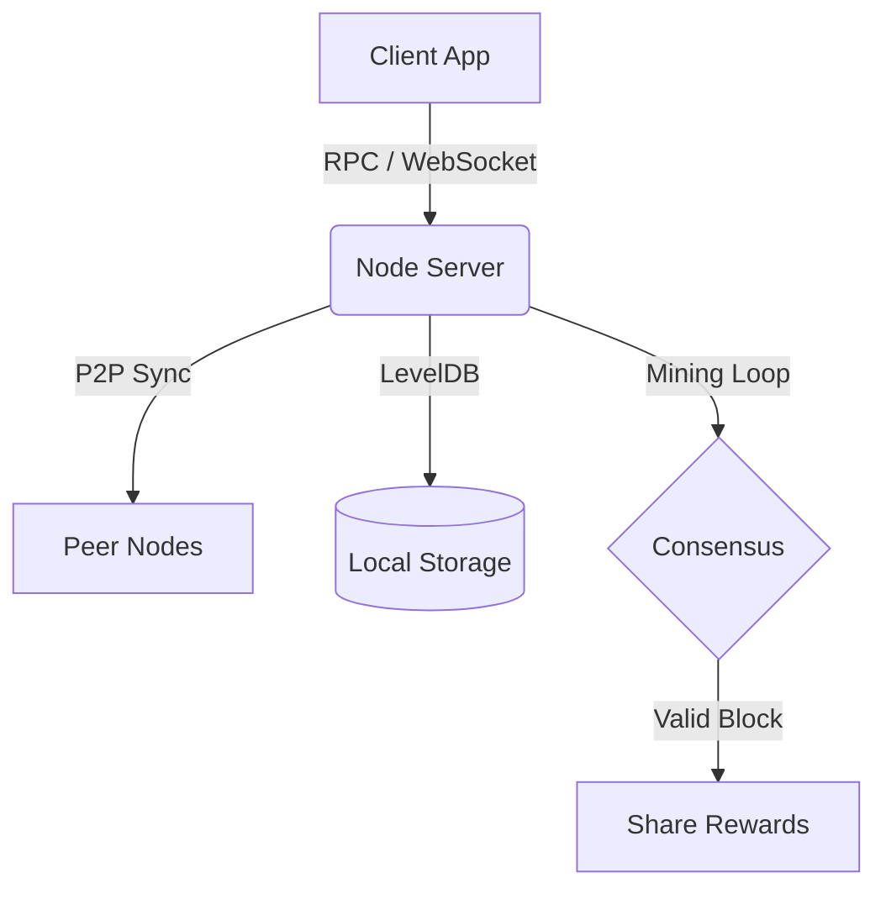

# TraceNet Blockchain (V2.6) ⛓️

**The Delegated Proof of Activity (DPoA) Blockchain for the Social Economy.**

[](LICENSE)
[](https://tracenet-blockchain-bbzxtm72vq-uc.a.run.app)
[](WHITEPAPER.md)

---

## 📖 Introduction

**TraceNet** is a specialized Layer-1 blockchain built for high-frequency social interactions and secure messaging. Unlike general-purpose blockchains, TraceNet integrates social primitives (likes, comments, follows) directly into its consensus and fee layer, enabling a sustainable "Social Economy".

It uses a unique **Delegated Proof of Activity (DPoA)** consensus mechanism that rewards participation and uptime rather than just wealth or raw hash power.

---

## 🚀 Key Features

### 🛡️ Core Consensus (DPoA)
*   **Validator Selection:** Round-robin selection with automatic fallback.
*   **Fair Mining:** Rewards are distributed to a **Mining Pool** shared by all active nodes, not just the block producer.
*   **Anti-Sybil:** Network-level IP restriction ensures 1 node = 1 person/entity.

### 💰 Social Economy & Tokenomics
*   **Native Token:** **TRN** (TraceNet Token).
*   **Fair Distribution:**
    *   **45%** → Content Creator / Node Owner (Immediate Reward)
    *   **30%** → Mining Pool (Shared Community Reward)
    *   **20%** → Supply/Recycle (Deflationary Pressure)
    *   **5%** → Network Development
*   **Micro-Fees:** Optimized for frequent social actions (0.00001 TRN per like).

### ⚡ Innovative Messaging
*   **Time-Based Fee Windowing:** Users choose between Cost vs. Speed.
    *   **FAST:** Instant block inclusion (Higher fee).
    *   **STANDARD:** 10-minute batch window.
    *   **LOW:** 1-hour batch window (Ultra-low fee).
*   **Privacy:** Native X25519 encryption for all partial messages.

---

## 🛠️ Architecture

TraceNet is built with strict modularity using **TypeScript**.



*   **Runtime:** Node.js
*   **Database:** LevelDB
*   **Network:** WebSocket (Socket.io) P2P mesh

---

## 🏁 Getting Started

### Prerequisites
*   Node.js v18+
*   npm or yarn

### Installation

```bash
# Clone the repository
git clone https://github.com/LodosLawson/TraceNet.git

# Enter directory
cd TraceNet

# Install dependencies
npm install

# Build the project
npm run build

# Start your node
npm start
```

Your node will start syncing with the mainnet and expose an RPC interface at `http://localhost:3000`.

---
## 💻 Netra Desktop Client (Recommended)
We provide a Python-based GUI for easy node management, wallet control, and social interaction.

### Launching the Client
```bash
python tools/gui_miner/main.py
```

### Features
*   **Node Manager**: Start/Stop/Restart your local node with one click.
*   **Wallet**: Generate keys and bind them to your node to receive fees.
*   **Netra Feed**: View social posts and tweet directly from the app.
*   **Transfers**: Send TRN coins to other users easily.
*   **Advanced Config**: Edit ports, peers, and `.env` settings directly.

---

## 📄 Documentation

We have detailed documentation available for developers and miners:

*   **[WHITEPAPER.md](WHITEPAPER.md)**: The philosophical and theoretical foundation.
*   **[TECHNICAL_REPORT.md](TECHNICAL_REPORT.md)**: Deep dive into the V2.6 architecture.
*   **[UCRET_YAPISI.md](UCRET_YAPISI.md)**: Detailed fee schedule and distribution rules.
*   **[UNIT_SYSTEM.md](UNIT_SYSTEM.md)**: Guide to TRN integer units (1 TRN = 100,000,000 units).

---

## 🤝 Contributing

TraceNet is open-source software. We welcome contributions!

1.  Fork the repository.
2.  Create your feature branch (`git checkout -b feature/AmazingFeature`).
3.  Commit your changes (`git commit -m 'Add some AmazingFeature'`).
4.  Push to the branch (`git push origin feature/AmazingFeature`).
5.  Open a Pull Request.

---

## 🔗 Links

*   **Live Explorer:** [TraceNet Explorer](https://tracenet-blockchain-bbzxtm72vq-uc.a.run.app)
*   **GitHub:** [LodosLawson/TraceNet](https://github.com/LodosLawson/TraceNet)
*   **License:** [MIT](LICENSE)

---

**© 2026 TraceNet Network.** *Built for the user, owned by the user.*
