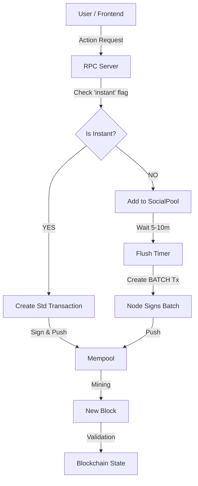

# TraceNet Transaction Mechanics: Instant vs. Batch

This report details how **Instant** and **Batch** transactions operate within the TraceNet architecture, largely focused on high-volume Social interactions (Likes, Comments).

## 1. Overview

TraceNet uses a dual-pathway system to handle social scalability:
1.  **Instant Transactions:** Fast, guaranteed inclusion, higher fee.
2.  **Batch Transactions:** Slower, aggregated, lower fee (Default).

This hybrid approach allows the network to handle thousands of likes/comments per second without bloating the blockchain state or overwhelming validators.

---

## 2. Instant Transactions (`Main Queue`)

**Use Case:** Urgent actions where immediate confirmation is required (e.g., sending money, premium interaction, critical alert).

### Mechanism
1.  **User Request:** frontend sends a request with `instant: true` flag.
2.  **Fee:** The user pays **2x the standard fee**.
3.  **Process:**
    *   The API (`SocialService`) bypasses the `SocialPool`.
    *   A standard `Transaction` is created immediately.
    *   The transaction is signed by the user and pushed directly to the `Mempool`.
4.  **Result:** The user receives a real `tx_id` immediately. The status is `confirmed` (meaning accepted into Mempool waiting for next block).

### Pros & Cons
*   ✅ **Fast:** Appears on-chain in the very next block (~2 seconds).
*   ✅ **Guaranteed:** No waiting for batch timers.
*   ❌ **Expensive:** Cost is double.
*   ❌ **Bloat:** One transaction per action (1 Like = 1 Tx on chain).

---

## 3. Batch Transactions (`SocialPool`)

**Use Case:** High-volume, low-criticality actions (e.g., liking a viral post, general comments). This is the **default** mode.

### Mechanism
1.  **User Request:** Frontend sends a standard request (default).
2.  **Fee:** Standard fee (e.g., 0.00001 LT).
3.  **Process:**
    *   The API adds the action to the **`SocialPool`** (an off-chain memory queue).
    *   The user receives a temporary ID: `PENDING-BATCH-...`. Status: `queued`.
    *   **Accumulation:** Actions accumulate in memory for a set window:
        *   **Likes:** 10 Minutes
        *   **Comments:** 5 Minutes
    *   **Flush:** When the timer expires, the **Node** creates a single `BATCH` transaction.
    *   **Payload:** This single transaction contains hundreds of user actions inside its `payload`.
    *   **Signature:** The **Node** signs the container transaction.
4.  **Result:** The batch is mined. The blockchain unpacks the payload and applies the effects (fees deducted, likes counted) virtually.

### Pros & Cons
*   ✅ **Efficient:** 1000 Likes = 1 Tx on chain. Massive storage savings.
*   ✅ **Cheap:** Standard low fee.
*   ❌ **Latency:** User might wait 5-10 minutes for "On-Chain" confirmation (though frontend shows it instantly via Optimistic UI).

---

## 4. API Endpoints

The following REST API endpoints handle these operations.

### Social Actions

| Action | HTTP Method | Endpoint | Payload Parameters |
| :--- | :--- | :--- | :--- |
| **Like** | `POST` | `/api/social/like` | `wallet_id`, `content_id`, `signature`, `instant` (bool) |
| **Comment** | `POST` | `/api/social/comment` | `wallet_id`, `content_id`, `text`, `signature`, `instant` (bool) |

*Note: The backend decides whether to route to Mempool (Instant) or SocialPool (Batch) based on the `instant` flag in the payload.*

### Financial / Core

| Action | HTTP Method | Endpoint | Description |
| :--- | :--- | :--- | :--- |
| **Transfer** | `POST` | `/rpc/transfer` | Always Instant. Standard financial transfer. |
| **Balance** | `GET` | `/rpc/balance/:id` | Returns `confirmed`, `available`, and `pending` balances. |

### Data Consistency
To ensure users don't see "missing" money or likes while a batch is pending:

*   **Balance Endpoint:** automatically subtracts the cost of pending batch actions from the `available_balance` it returns.
*   **Content Feeds:** The `SocialService` aggregates `Confirmed Likes (Chain)` + `Pending Likes (Pool)` so the count looks correct immediately.

---

## 5. Technical Flow Diagram



## 6. Netra Integration Guide (Code Examples)

This section provides copy-paste ready examples for connecting the **Netra Application** to the TraceNet Blockchain.

**Base URL:** `https://tracenet-blockchain-136028201808.us-central1.run.app`

### 6.1. Fetching User Balance
Retrieves confirmed balance, available balance (minus pending actions), and any pending cost.

```javascript
// GET /rpc/balance/:wallet_id
const walletId = "TRN..."; 
const response = await fetch(`https://tracenet-blockchain-136028201808.us-central1.run.app/rpc/balance/${walletId}`);
const data = await response.json();

console.log(data);
/* Output:
{
  "wallet_id": "TRN...",
  "balance": 500,           // On-Chain Confirmed
  "available_balance": 495, // Use THIS for UI (Real spendable)
  "pending_deductions": 5   // Cost of actions currently in SocialPool/Mempool
}
*/
```

### 6.2. Sending a Transaction (Transfer)
Transfers are always **Instant**. Requires client-side signing (Ed25519).

```javascript
// POST /api/transaction/create
const payload = {
    from_wallet: "TRN_SENDER...",
    to_wallet: "TRN_RECEIVER...",
    amount: 100, // Amount in base units
    priority: "STANDARD", // or "HIGH" for faster mining
    sender_public_key: "...", // Hex string
    // Signature of: `${from}:${to}:${amount}:${nonce}` (See KeyManager.ts)
    sender_signature: "..."   // Hex string
};

const response = await fetch('https://tracenet-blockchain-136028201808.us-central1.run.app/api/transaction/create', {
    method: 'POST',
    headers: { 'Content-Type': 'application/json' },
    body: JSON.stringify(payload)
});
```

### 6.3. Liking Content (Batch - Default)
**Recommended.** Uses the SocialPool. Cheaper, cleaner, but takes 5-10m to finalize on-chain.

```javascript
// POST /api/social/like
const payload = {
    wallet_id: "TRN_USER...",
    content_id: "post_123",
    timestamp: Date.now(),
    sender_public_key: "...",
    // Signature of: `${wallet_id}:LIKE:${content_id}:${timestamp}`
    signature: "..." 
};

// ... Standard Fetch ...
```

### 6.4. Liking Content (Instant - Urgent)
**CRITICAL:** To do an **Instant** Like, you CANNOT use the `/api/social/like` endpoint because it cannot generate a valid user signature for a standard transaction.
Instead, you must construct and sign a full `Transaction` on the client side.

```javascript
// POST /api/transaction/create
// NOTE: You must calculate the fee manually (e.g. 0.00002 LT)

const txPayload = {
    action_type: 'LIKE',
    content_id: "post_123",
    target_content_id: "post_123"
};

const transactionData = {
    from_wallet: "TRN_USER...",
    to_wallet: "TRN_CREATOR...", // You must know the creator's address!
    type: "LIKE",
    amount: 100, // Creator Share
    fee: 100, // Validator Fee
    nonce: Date.now() % 1000000,
    payload: txPayload,
    timestamp: Date.now(),
    sender_public_key: "..."
};

// Sign the full transaction structure (Client Side)
// Signature of JSON.stringify({ tx_id, from, to, type, payload, amount, fee ... })
transactionData.sender_signature = signTransaction(transactionData);

const response = await fetch('https://tracenet-blockchain-136028201808.us-central1.run.app/api/transaction/create', {
    method: 'POST',
    body: JSON.stringify(transactionData)
});
```

### 6.5. Posting a Comment (Batch)
Comments follow the same batching logic.

```javascript
// POST /api/social/comment
const payload = {
  // ... standard comment payload ...
  instant: false // Always false for simple endpoint
};
```

